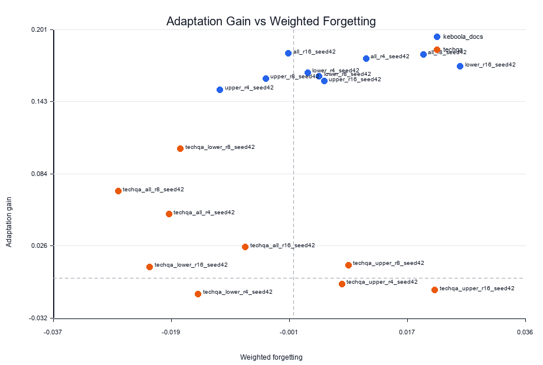
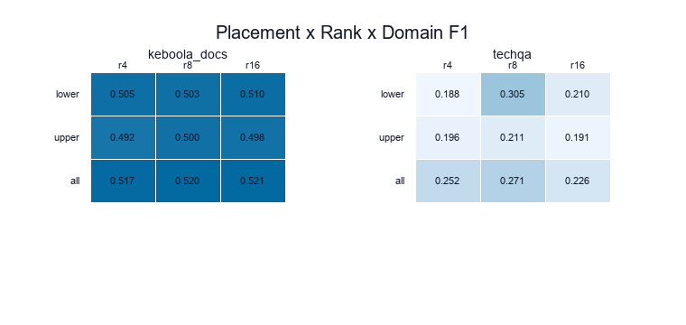
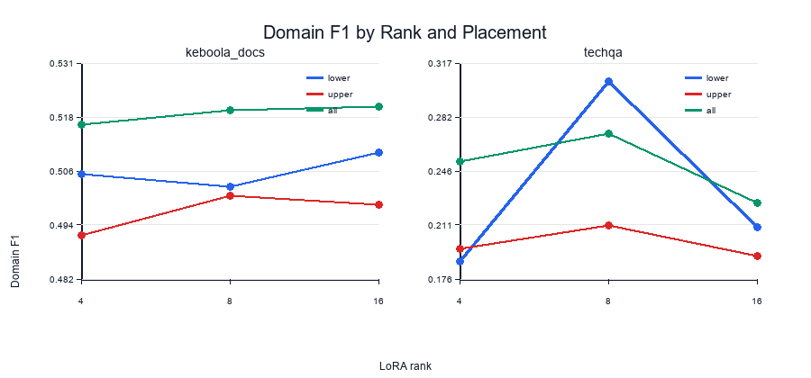

# LoRA-based Domain Adaptation in LLMs: Effects of Layer Placement and Rank on Adaptation and Forgetting

This project compares how LoRA layer placement and rank affect domain adaptation performance and resistance to forgetting.

## 한눈에 보기
- 1차 파일럿 도메인: `Keboola/Developer-Documentation-QA`
- 2차 확장 도메인: `rojagtap/tech-qa`
- 기본 모델: `Qwen/Qwen2.5-3B-Instruct`
- smoke 모델: `Qwen/Qwen2.5-0.5B-Instruct`
- 핵심 지표:
  - `domain F1`
  - `BoolQ accuracy`
  - `PIQA accuracy`
  - `weighted general accuracy`
  - `WikiText perplexity`

## 결론
- 결과에서는 Keboola와 TechQA에서 최적 LoRA 조합이 서로 다르게 나타났습니다.
- Keboola 파일럿에서는 `all_r16_seed42`, TechQA 확장에서는 `techqa_lower_r8_seed42`가 가장 높은 domain F1을 보였습니다.
- rank별 최적 조합도 도메인마다 다르게 나타났고, 이는 데이터 크기, 입력 구조, 문맥 길이 차이의 영향을 받았을 가능성이 있습니다.
- 평가 범위에서는 catastrophic forgetting의 영향이 거의 없었고, 일부 조합은 base보다 weighted general accuracy가 소폭 좋아졌습니다.
- 다만 현재 결론은 2개 도메인과 seed 42 기준이므로, 추후 도메인 확장이나 추가 seed 실험으로 재현성을 더 검증할 여지가 있습니다.

## 주요 지표 표
| 단계 | 도메인 | base run | 최고 domain run | domain F1 | adaptation gain | weighted general accuracy | weighted forgetting |
| --- | --- | --- | --- | ---: | ---: | ---: | ---: |
| 파일럿 | keboola_docs | `keboola_base` | `all_r16_seed42` | 0.5208 | 0.1814 | 0.7498 | -0.0008 |
| 확장 | techqa | `techqa_base` | `techqa_lower_r8_seed42` | 0.3050 | 0.1043 | 0.7664 | -0.0174 |

보조 composite 기준 최고 run도 동일합니다.
- Keboola: `all_r16_seed42`
- TechQA: `techqa_lower_r8_seed42`

## 결과 이미지
### Adaptation Gain vs Forgetting


### Placement x Rank x Domain F1


### Rank별 Domain F1 추이


## 프로젝트 구조
```text
project_root/
  configs/
    pilot.yaml
    techqa.yaml
    matrix/
      pilot_rank_placement.yaml
      techqa_full_matrix.yaml
  outputs/
    cache/
    runs/
    summary/
  results/
    RESULTS_OVERVIEW.md
    figures/
    tables/
  src/
    analysis.py
    config_schema.py
    data.py
    eval.py
    experiment.py
    train.py
```

## 데이터셋 설정
### 1차 파일럿: Keboola
- 데이터셋: `Keboola/Developer-Documentation-QA`
- 원본 형식: `filename`, `question`, `answer`
- 현재 파이프라인은 `filename`으로 Keboola 문서를 복원해 `context_qa` 실험을 수행합니다.
- 준비된 스냅샷: `outputs/cache/keboola_domain_snapshot.json`

### 2차 확장: TechQA
- 데이터셋: `rojagtap/tech-qa`
- native field: `document`, `question`, `answer`
- 준비된 스냅샷: `outputs/cache/techqa_domain_snapshot.json`

짧은 context, title-only context, 깨진 문자열이 많은 context는 자동으로 정제하거나 `qa_only`로 강등합니다.

## 실행 흐름
프로젝트 루트에서 아래 셀을 먼저 실행합니다.

```python
from pathlib import Path
import sys

SRC_ROOT = Path("src").resolve()
if str(SRC_ROOT) not in sys.path:
    sys.path.insert(0, str(SRC_ROOT))
```

### 1. Hub 접근 확인
```python
from experiment import diagnose_hf_access, probe_hf_access

diagnose_hf_access()
probe_hf_access("configs/pilot.yaml")
```

### 2. 도메인 스냅샷 고정
```python
from experiment import freeze_domain_dataset

freeze_domain_dataset("configs/pilot.yaml")
freeze_domain_dataset("configs/techqa.yaml")
```

### 3. 단일 run 실행
```python
from experiment import prepare_config, build_smoke_overrides, run_experiment

smoke_config = prepare_config(
    "configs/pilot.yaml",
    overrides=build_smoke_overrides(force_rerun=True),
)
smoke_metrics = run_experiment(smoke_config)
smoke_metrics
```

### 4. batch 실행
```python
from experiment import run_batch

keboola_result = run_batch("configs/matrix/pilot_rank_placement.yaml", force_rerun=False)
techqa_result = run_batch("configs/matrix/techqa_full_matrix.yaml", force_rerun=False)
```

### 5. 재평가
```python
from experiment import reevaluate_batch

reeval_result = reevaluate_batch(outputs_root="outputs")
reeval_result["summary"]
```

### 6. 결과 묶음 생성
```python
from experiment import export_results_bundle

bundle = export_results_bundle(outputs_root="outputs", results_root="results")
bundle
```

## 결과 폴더 규칙
### 원본 실험 산출물
- `outputs/runs/`: run별 raw artifact
- `outputs/summary/`: summary CSV, 이미지, markdown

### 결과 산출물
- `results/tables/`: CSV와 summary markdown
- `results/figures/`: PNG 이미지
- `results/RESULTS_OVERVIEW.md`: 핵심 결과 요약 문서

## summary 해석 원칙
- raw metric을 우선합니다.
- 가장 중요한 표는 `results/tables/runs_summary.csv`입니다.
- 빠른 요약은 `results/tables/domain_best_runs.csv`와 `results/RESULTS_OVERVIEW.md`를 보면 됩니다.
- `composite_score`는 보조 지표입니다.
  - `adaptation_gain`: 0.6
  - `weighted general retention`: 0.3
  - `WikiText retention`: 0.1

## 파이프라인 규칙
- base run 이름은 domain별 canonical name을 사용합니다.
  - `keboola_docs -> keboola_base`
  - `techqa -> techqa_base`
- 비기본 도메인의 adapter run은 자동 생성 시 domain prefix를 붙입니다.

## 아티팩트 점검 및 정리
## 학습 로그 형식
매 epoch마다 아래 항목이 출력되고 `train_log.jsonl`에도 저장됩니다.
- `epoch`
- `train loss`
- `val loss`
- `val acc`
- `lr`

여기서 `val acc`는 validation domain F1입니다.

## 참고사항
- 최신 `transformers`에서는 `dtype`를 우선 사용하고 필요하면 `torch_dtype`로 fallback 합니다.
- Hugging Face Hub 기본 설정:
  - `HF_HUB_DISABLE_XET=1`
  - `HF_HUB_DOWNLOAD_TIMEOUT=60`
  - `HF_HUB_ETAG_TIMEOUT=30`
- `ybisk/piqa`가 최신 `datasets`에서 막히면 공식 원본 파일 URL에서 직접 읽는 fallback 로더를 사용합니다.
